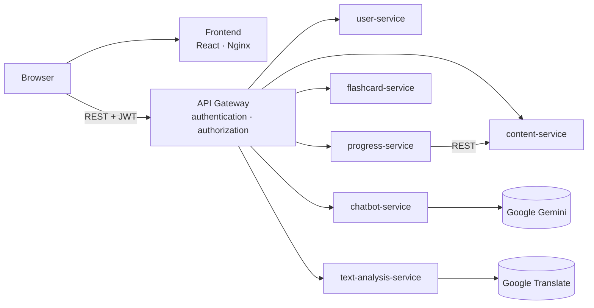

# Mandarin Learning App

A web platform for learning Mandarin Chinese, built as my Bachelor's thesis in Computer Engineering.
Teachers create structured courses with interactive exercises, while students learn through lessons,
spaced-repetition flashcards, text analysis and an AI conversation tutor.

The system follows a **microservice architecture**: six backend services behind an API gateway,
each with its own database, plus a React single-page application.

## Features

**Students**
- Courses organized into units and lessons, with multimedia materials (images, PDF, audio, video)
- Five exercise types with automatic evaluation: multiple choice, translation, fill in the blank, matching and sentence ordering
- XP, levels, lesson progress tracking and a leaderboard
- Flashcards scheduled with the **SM-2** spaced-repetition algorithm
- Text analysis for typed text or photos (OCR): word segmentation, pinyin, HSK level and translation for each word, with one-click flashcard creation
- Text-to-speech pronunciation for Chinese text
- AI tutor chat powered by Google Gemini, with saved conversation history

**Teachers**
- Create and manage units, lessons, materials and exercises
- Statistics on lessons, exercise types and earned XP

**Administrators**
- User management: create, edit, ban and delete accounts
- Platform-wide statistics

## Architecture



| Service | Responsibility | Stack |
|---|---|---|
| `api-gateway` | Single entry point; validates JWTs and enforces role-based access | Spring Cloud Gateway |
| `user-service` | Registration, login, user profiles, JWT issuing | Spring Boot |
| `content-service` | Units, lessons, materials, exercises, file uploads | Spring Boot |
| `progress-service` | Exercise evaluation, XP, lesson and unit progress | Spring Boot |
| `flashcard-service` | Flashcard sets and SM-2 review scheduling | Spring Boot |
| `chatbot-service` | AI tutor conversations | Spring Boot · Gemini API |
| `text-analysis-service` | OCR, Chinese NLP, HSK levels, translation | FastAPI · EasyOCR · spaCy |
| `frontend` | Web interface for all three roles | React · TypeScript |

Each backend service owns a separate **PostgreSQL** database. Services follow a layered design
(controller → service → DAO), with domain models kept separate from persistence entities.

## Tech Stack

- **Backend:** Java 21, Spring Boot 4, Spring Security, Spring Data JPA, Spring Cloud Gateway, JWT
- **NLP service:** Python, FastAPI, SQLAlchemy, EasyOCR, spaCy (`zh_core_web_md`), pypinyin
- **Frontend:** React 19, TypeScript, Vite, Tailwind CSS, shadcn/ui, Zustand, React Hook Form + Zod, Recharts
- **Infrastructure:** PostgreSQL 16, Docker Compose, Nginx

## Getting Started

### Prerequisites

- [Docker](https://docs.docker.com/get-docker/) with Docker Compose
- Optional API keys: [Gemini](https://aistudio.google.com/apikey) for the AI tutor and
  [Google Cloud Translation](https://cloud.google.com/translate) for word translations.
  Everything else works without them.

### Run

```bash
git clone git@github.com:tavim26/mandarin-learning-app.git
cd mandarin-learning-app
cp .env.example .env    # then fill in the values
docker compose up -d --build
```

The first build takes several minutes. The OCR model is downloaded on the first image analysis.

| URL | |
|---|---|
| http://localhost | Web application |
| http://localhost:8080 | API gateway |

An administrator account is created on first startup from `ADMIN_EMAIL` and `ADMIN_PASSWORD` in `.env`.
Students and teachers can register from the web interface.

### Configuration

All settings are read from environment variables (see [`.env.example`](.env.example)):

| Variable | Purpose |
|---|---|
| `POSTGRES_PASSWORD` | Password for all PostgreSQL databases |
| `JWT_SECRET` | Base64 key for signing tokens (`openssl rand -base64 32`) |
| `ADMIN_EMAIL`, `ADMIN_PASSWORD` | Initial administrator account |
| `GEMINI_API_KEY` | AI tutor (optional) |
| `GOOGLE_TRANSLATE_API_KEY` | Word translations in text analysis (optional) |

## Project Structure

```
mandarin-learning-app/
├── api-gateway/              # Spring Cloud Gateway
├── user-service/             # Spring Boot
├── content-service/          # Spring Boot
├── progress-service/         # Spring Boot
├── flashcard-service/        # Spring Boot
├── chatbot-service/          # Spring Boot
├── text-analysis-service/    # FastAPI
├── frontend/                 # React + Vite
├── docker-compose.yml
└── .env.example
```

## License

This project is licensed under the [MIT License](LICENSE).
